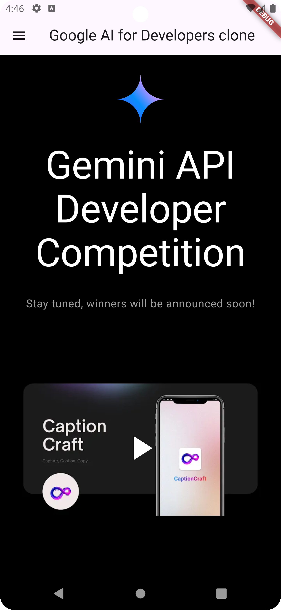
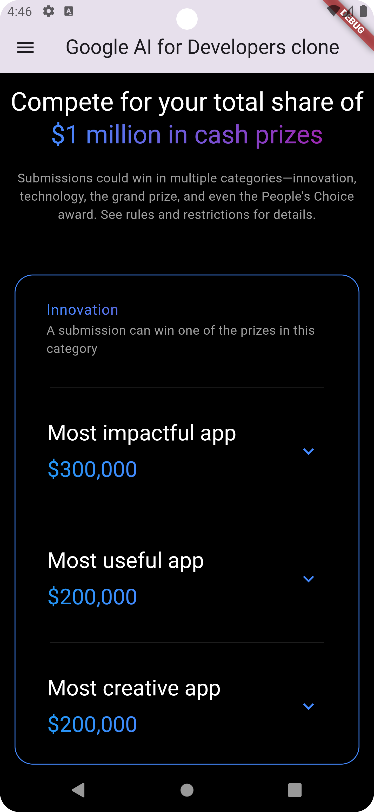
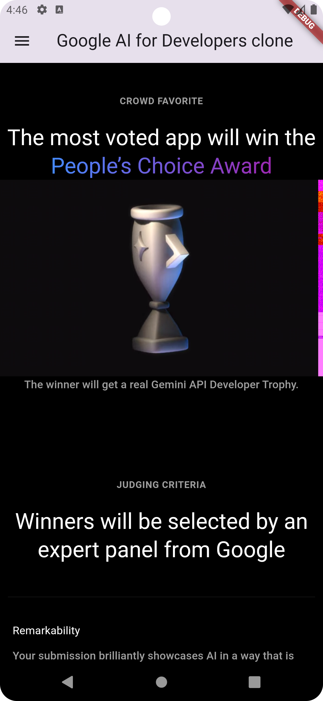

# Google Gemini Dev Competition Website Clone

This project is a Flutter-based clone of the **Google Gemini Dev Competition** website. The goal of this project is to replicate the website's design and functionality using Flutter, offering a seamless and responsive experience across various devices.

## Features

- Responsive design for both mobile and desktop views.
- Fully functional UI/UX design based on the original Google Gemini Dev Competition website.
- Smooth transitions and animations using Flutter's powerful UI components.
- Custom widgets to match the look and feel of the original website.
- Easy to navigate, with support for multiple screens and pages.

## Screenshots

Here are some screenshots from the clone project:

| Home Page                        | Competition Details Page           | User Dashboard                    |
|-----------------------------------|------------------------------------|------------------------------------|
|  |  |  |

## YouTube Demo

Watch the full demo of this project on YouTube to see it in action:

[

Click the image above or use [this link](https://youtu.be/y1cAeb2ofZw) to watch the demo video.

## Getting Started

### Prerequisites

Make sure you have the following installed:

- Flutter SDK (version 3.5.2 or later)
- Dart SDK
- An IDE (like VSCode or Android Studio) with Flutter and Dart plugins

### Installation

1. Clone this repository:
    ```bash
    git clone https://github.com/mahesh1071997/google-dev-competition.git
    ```

2. Navigate to the project directory:
    ```bash
    cd google-dev-competition
    ```

3. Install the dependencies:
    ```bash
    flutter pub get
    ```

4. Run the project:
    ```bash
    flutter run
    ```

## Project Structure

The project follows Flutter's recommended folder structure. Key folders include:

- **lib/screens/** - Contains the UI screens for different pages.
- **lib/widgets/** - Custom widgets for various UI components.

## Contributions

Contributions are welcome! If you want to add features or improve the code, feel free to fork the repository and submit a pull request.

## Contact

For any questions or feedback, feel free to reach out:

- **Email:** dabhi.mahesh.r107@gmail.com
- **LinkedIn:** [Your LinkedIn Profile]([https://linkedin.com/in/yourprofile](https://www.linkedin.com/in/maheshdabhi/))
